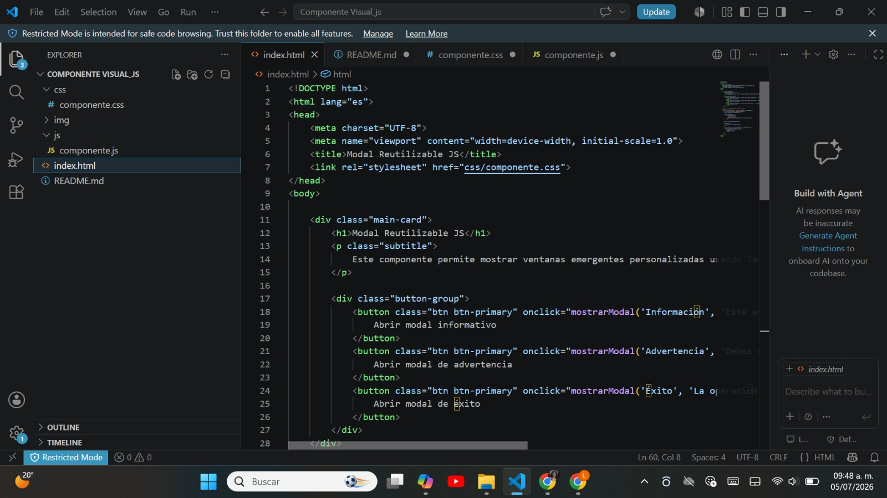
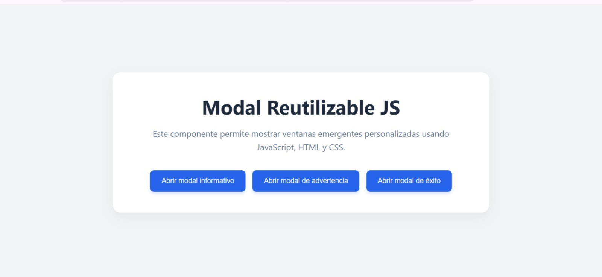
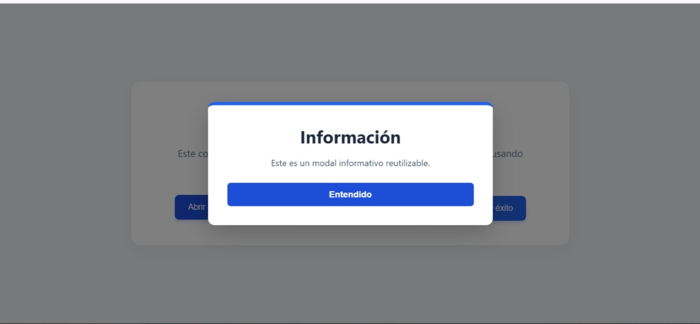
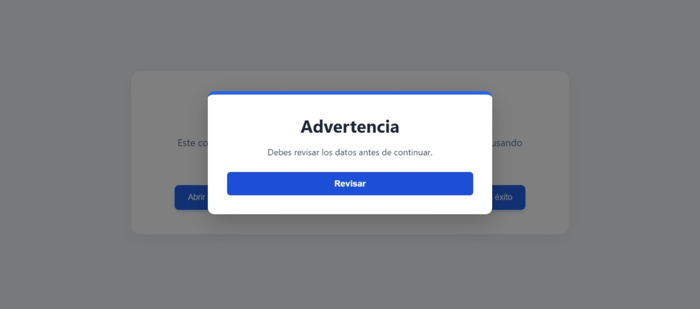
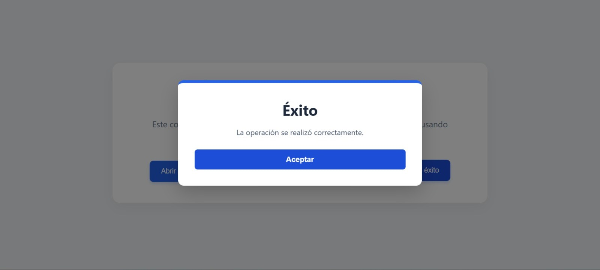

Actividad 3 - Modal Reutilizable JS

-Portada

Nombre: Litzi Teresa González Cruz  
Materia: Programación Web  
Actividad: Componente Visual Interactivo - Modal Reutilizable  
Docente:Adelina Martinez Nieto  
Instituto: Instituto Tecnológico de Oaxaca

¿Qué problema resuelve?
En el desarrollo web, las ventanas emergentes (modales) nativas del navegador mediante `alert()` o `confirm()` carecen de estilo, interrumpen bruscamente la experiencia del usuario y no son personalizables.
-Componente Visual: Modal Reutilizable JS

Este es un componente web dinámico desarrollado con HTML5, CSS3 y JavaScript vanilla que permite mostrar ventanas emergentes (modales) personalizadas e interactivas sin depender de librerías externas.

- Características
Reutilizable:Una sola función controla múltiples tipos de mensajes (Información, Advertencia, Éxito, etc.).
 Animaciones fluidas: Transición de entrada y salida integrada mediante clases de CSS.
 Fácil integración: Se adapta rápidamente a cualquier proyecto web estructurado.

- Estructura del Proyecto
El proyecto está organizado de la siguiente manera:
 `index.html` - Estructura principal con los botones de acción.
 `css/componente.css` - Estilos visuales del contenedor y de los modales.
 `js/componente.js` - Lógica en JavaScript para generar e inyectar el modal en el DOM.
 `img/` - Carpeta para el almacenamiento de recursos visuales y capturas.

- Cómo Utilizarlo

Para desplegar un modal en pantalla, se debe invocar la función `mostrarModal()` pasando los parámetros correspondientes en tus elementos HTML:

```html
<button onclick="mostrarModal('Tu Título', 'Tu mensaje personalizado aquí', 'TextoBotón')">
    Abrir Modal
</button>
Parámetros de la función:
Título (String): El encabezado que se mostrará en la caja blanca.

Mensaje (String): El texto descriptivo o cuerpo de la alerta.

Texto del Botón (String): (Opcional) Texto del botón de cierre. Por defecto es "Entendido".

. Interfaz Principal del Proyecto
Alineación central de la librería visual con sus tres botones activos.


. Modal Informativo en Funcionamiento
Ventana emergente que se activa al dar clic en el primer botón.


. Modal de Advertencia en Funcionamiento
Ventana de alerta con mensaje de revisión y botón personalizado.


. Modal de Éxito en Funcionamiento
Ventana de confirmación que notifica que la operación fue correcta.


. Estructura de Carpetas y Consola Limpia
Evidencia de la organización del código y el correcto enlazado sin errores.


https://drive.google.com/file/d/1qxSgqoaOuxivGDLugUaTPPBN0saA-CEF/view?usp=drive_link