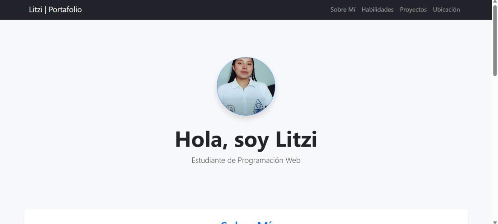
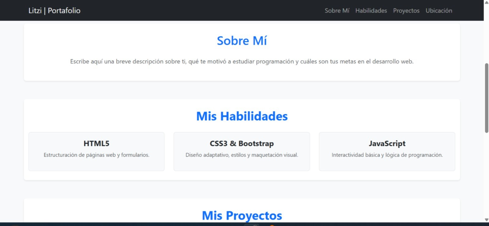
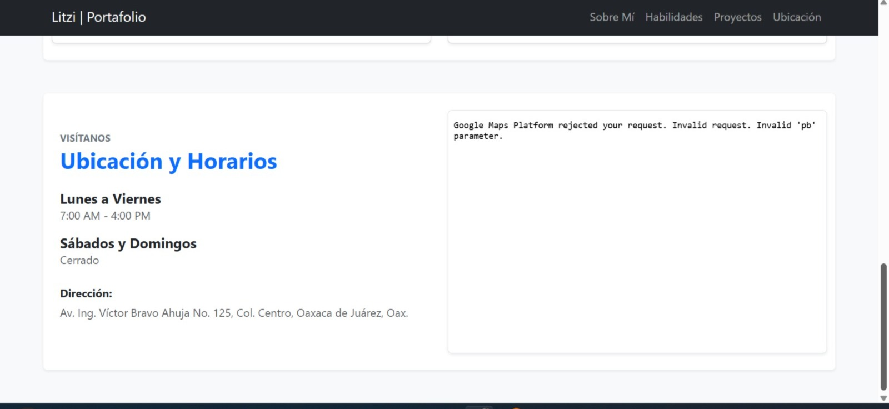

Portafolio Web Profesional - Litzi

Este proyecto es un portafolio web personal desarrollado como parte de las actividades prácticas del curso de programación. Está diseñado para ser completamente responsivo, limpio y funcional, permitiendo dar a conocer mi perfil como estudiante, mis habilidades técnicas y los proyectos en desarrollo.

 Descripción del proyecto

-Framework CSS usado:Bootstrap 5 (vinculado mediante CDN). Se utilizó principalmente para estructurar la página con su sistema de rejilla/columnas (`row` y `col`), la barra de navegación y las tarjetas adaptativas. Además, cuenta con un archivo personalizado `css/styles.css` para gestionar pequeños ajustes de color y presentación.
-Diseño:Limpio y moderno, con un fondo claro (`bg-light`), tarjetas blancas que resaltan el contenido y tipografías oscuras que facilitan una lectura profesional.

Secciones del portafolio

-Inicio / Encabezado: Contiene mi foto de perfil real y formal en formato circular, mi nombre completo y mi rol actual como estudiante de desarrollo web.
-Sobre mí: Una breve descripción de quién soy, destacando mis objetivos de aprendizaje y mi motivación en la programación web.
-Habilidades (Skills): Tarjetas organizadas con Bootstrap que muestran los lenguajes y herramientas que estoy aprendiendo y practicando (HTML5, CSS3, Bootstrap y JavaScript).
-Proyectos:Dos bloques estructurados en columnas que describen las prácticas del curso de verano (Ejercicios del 1 al 17) y la planeación de este portafolio web.
-Ubicación y Horarios:Sección final dividida en dos columnas responsivas. La columna izquierda muestra texto organizado con los horarios de atención y la dirección, mientras que la columna derecha integra un mapa interactivo.

 Proceso de creación

-Configuración inicial: Elegí Bootstrap 5 como la base del diseño e importé los estilos mediante su CDN en la etiqueta `<head>` de mi archivo `index.html`.
-Estructura semántica:Diseñé un sitio de una sola página (*Single Page Application*) utilizando etiquetas semánticas de HTML5 como `<nav>`, `<header>`, `<section>` y `<footer>`.
-Personalización de datos:** Adapté la información de cada módulo con mis datos reales, vinculando correctamente mi foto formal dentro de la carpeta `img/`.
Integración del mapa: Embebí un mapa interactivo de Google Maps enfocado en el Instituto Tecnológico de Oaxaca mediante una etiqueta `<iframe>`, asegurando que estuviera estructurado dentro de una columna responsiva para que no rompiera el diseño en pantallas pequeñas.
-Organización del repositorio:Ordené los archivos dentro del espacio de trabajo creando carpetas separadas para los estilos (`css/`), los scripts (`js/`) y los recursos visuales (`img/`).

 Capturas de pantalla

 Inicio y Presentación

Sobre Mí y Habilidades

 Proyectos, Ubicación y Mapa
